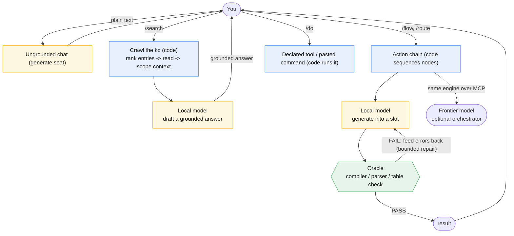

# Ratchet architecture: propose, then verify

How Ratchet turns an unreliable local model into a reliable operator. The two pieces that do the work
are the **Oracle** (deterministic verification) and **Context Binding** (scoped context per step);
the [Lineage](#lineage) section credits what's borrowed vs new. For the user-facing commands see
[Use the console](../how-to/use-the-console.md); for authoring ratchets see [Build a ratchet](../how-to/build-a-ratchet.md).

## The core thesis

A small local model is unreliable when you ask it to *decide* things or to drive an open-ended
tool-calling loop. It is reliable when each call is narrow and its output is checked. So the host
splits every task into three roles with one trust line:

| Role | Trusted to | Not trusted to |
| --- | --- | --- |
| **Model** (the proposer) | pick from an enum, draft text, write one table row | be right on its own; choose what runs next |
| **Code** (the glue) | read files, run tools, sequence steps | (it has no judgment to misuse) |
| **Oracle** (the decider) | accept or reject a proposal, deterministically | have opinions |

The reliability comes from **structure plus the Oracle**, not from the model being smart. Concretely:

- **EMBEDDER** narrows candidates; it never decides or generates. It ranks flows / KB entries by
  similarity and keeps the top-k before a constrained pick. Falls back to the full list when no `embed`
  seat is set or Ollama is down.
- **BASE MODEL** proposes: picks from an enum, drafts text, writes a row. Never trusted to be right
  alone or to pick the next step.
- **ORACLE** accepts or rejects. Examples: the in-box C# compiler (does it build?), a PowerShell
  parser (does it parse?), and a schema-driven validator for tab-separated tables (right column count,
  types, numeric ranges, enum membership, cross-table references). The verdict is deterministic, so a
  wrong proposal is caught - and the exact errors are fed back for a **bounded** repair.

A deliberate limit: oracle-pass means **"won't break," not "is correct."** It enforces *form* - valid
structure, a known node kind, a referenced tool/path that exists, unique names, field bounds, a clean
compile - never *intent or quality*. A structurally valid chain can still do the wrong thing, and a
clean compile is not a behavior proof. So the Oracle is set to cover exactly the breakage-preventers,
the model proposes freely within that, and a human reviews intent. This is the same `compile !=
behavior-verified` caveat applied everywhere.

Two guardrails keep this honest:

- **The operator drives; the model never picks actions.** Slash commands dispatch deterministically;
  plain text is ordinary chat. The model only picks a workflow when you explicitly ask it to
  (`/route`), and even then a deterministic gate keeps only a confident, on-list match and you confirm
  before it runs.
- **Tools are declared; the model only fills arguments.** A tool's command is authored in the
  ratchet, never invented by the model. *Which* tool runs is decided by an authored chain or by a
  capable orchestrator over MCP - never by an open local-model loop.

## Context binding

The other half of reliability (alongside the Oracle) is **what each step is allowed to see**. A step
in a chain is given *only* its declared inputs, bound into named slots and capped in size - never a
cumulative transcript, prior prompts, or engine state. Each binding names its source:

- a prior step's output,
- a fixed reference entry (always present - for constant constraints), or
- a retrieval query against a knowledge library (RAG).

Two consequences. **Isolation:** every call gets a small, clean, known context - the single biggest
reliability gain for a weak model, which can't be confused by accumulated noise. **Placement:** the
author injects reference/retrieval grounding at the few *gates* that need it (deciding "the right
pattern," or grounding an idiomatic write), not on every step. Retrieval (RAG) is just one binding
source feeding this layer; Context Binding is the discipline that assembles each prompt from declared,
minimal, sourced slots.

(Note the name: this is **not** "prompt injection," the attack where untrusted input hijacks a model.
Context Binding is the opposite - a containment mechanism that controls exactly what reaches each
step.)

## How this differs from ICM

ICM as published assumes a *capable* orchestrating agent (the paper uses Claude) that **roams the
folder structure itself**: it reads the routing files, decides which entries and which stage to load,
produces each stage's output, and a human reviews the plain-file result. A small **local** model
can't do that - behind a generate API it has no file access and no tool use; it only turns a prompt
into text, and within a single call it can't be trusted to decide what runs next or to format itself.

So the host keeps ICM's "structure is the architecture" idea but moves the orchestration **out of the
model and into deterministic code**, and adds the machine check the frontier setup did not need:

| Concern | ICM (frontier agent) | This host (local model) |
| --- | --- | --- |
| Navigating the folders | the agent reads them and picks what to load | code crawls: the **embedder narrows**, a constrained **enum pick** chooses, then code reads and **injects** the scoped context |
| Sequencing | the agent decides what runs next | **slash commands** dispatch; authored **action chains** sequence multi-step work; the model never picks the step |
| Checking output | a human reviews each stage's file | a deterministic **oracle** gates output, with bounded repair (the human still edits) |
| Model output shape | trusted to format itself | **grammar/enum-constrained**, so only a valid shape can be emitted |
| Tools | the agent calls scripts / MCP as it sees fit | tools are **declared**; the model only fills arguments |
| Orchestrator seat | the capable agent, always | you drive from chat by default; the **same ratchet is exposed over MCP**, so a frontier model can take the seat |

The key move is the **injection**. Rather than letting the model wander the filesystem (safe for a
frontier model, not a local one), the host does the layered context loading itself and injects
precisely-scoped context into each constrained call. The model never crawls; code crawls *for* it and
hands it one narrow, checkable decision at a time. The same machinery is what the MCP server exposes -
one engine, two callers: the local dispatcher, or a frontier model over MCP.

## Control flow



Blue is deterministic code (the orchestrator), amber is the only points the local model is called
(each a single constrained proposal), green is the oracle. Code crawls and sequences; the model only
ever proposes.

## Lineage

Ratchet borrows deliberately and credits proportionately:

- **ICM** (Interpretable Context Methodology, Van Clief & McDermott) - the **structure-as-architecture**
  idea: folders as stages, plain-file prompts, human-inspectable/editable steps. Ratchet keeps that
  topology and moves orchestration into deterministic code.
- **RAG** - retrieval grounding, used as a technique (one Context Binding source).

Ratchet's own: **action chains** (flows as a filesystem graph of declared-input, slot-bound steps),
the **Oracle** (deterministic propose-then-verify with bounded repair), and the **Context Binding**
gating policy (what to inject, and where). The synthesis - a local model as a constrained proposer
inside a static, oracle-gated control graph - is the system.

## src/ layout

One flat `namespace Icm`; folders are organizational.

```
Conventions.cs   the ratchet contract in one place: file/dir names + intent/tool/action-kind constants
Json.cs          JSON parse/serialize + navigation + small object/schema builders
Model/           pure data: Config, Manifest, TableSchema, Chain, FlowInfo, Results
Runtime/         the engine: Instance (sandboxed IO), Oracle, Tsv, ToolRunner, Ollama, Dispatcher,
                 ChainEngine, ChainLint, KbIndex, Indexer, Search (BM25 core), Embedder
Server/Mcp.cs    the MCP server (tools/list + tools/call)
Cli/             the console executable: Program, ConsoleChat, SelfTest
```

The host is a **domain-agnostic harness**: it contains the chain engine, the dispatcher, the oracle
*mechanism* (the TSV validator), search/embedder mechanics, and the generic verbs. It hardcodes no
specific flow, tool, or knowledge - all of that lives in ratchets.

## Build

```
powershell -ExecutionPolicy Bypass -File build.ps1          # ratchet.exe
```

`build.ps1` calls the in-box .NET Framework `csc.exe` (pre-Roslyn, so the code targets **C# 5** - no
string interpolation, `?.`, expression-bodied members, or tuples), with no SDK, NuGet, or MSBuild. It
globs `src/` recursively into the single console executable (`Cli/` holds the one entry point). The only
non-default reference is `System.Web.Extensions.dll` (JSON). Verify a build with `.\ratchet.cmd selftest`
(asserts the oracle, JSON, TSV, argv quoting, the path-escape guard, chain lint, and path conventions -
all model-free).
